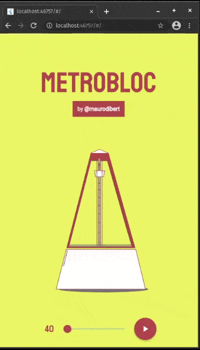

# MetroBloc
A Metronome built using the BLoC pattern and the flutter_bloc package.



## :pencil: How to Use 
**Step 1:**
Download or clone this repo by using the link below:

```
https://github.com/maurodibert/metrobloc.git
```
**Step 2:**
Go to project root and execute the following command in console to get the required dependencies: 
```
flutter pub get 
```
**Step 3:**
Run the app
```
flutter run
```
**APK:**
Just download and run in device
```
final_builds/app-release.apk
```

## :wrench: Libraries & Tools
* [flutter_bloc](https://pub.dev/packages/flutter_bloc) for state management.
* [rive](https://pub.dev/packages/rive) for animations.
* [howlerJS](https://howlerjs.com/) via javascript for simple audio management.


## :mag: Structure
With the separation of concerns in mind, I've built the application applying the BLoC architectural pattern, following the next folder structure:
```
lib
└── feature
    └── bloc
    └── components
    └── helpers
    └── view
    general files

```
At the same time, I've categorized code to make the maintenance easier and pleasurable; 
from scratch, perhaps, could be a little bit cumbersome for an app this small, but as soon as it gets bigger
will make for devs, life much more comfortable. 

## :gift: Features
* Speed programmatically managed
* Custom animation
* Simple sound playing
* Custom fonts

## :point_up: Decisions and Considerations
- **Stateful Widget instead of Bloc for Animation**: I've decided to simplify and listen to that widget with a BlocListener.
- **Make it simple**: I'm doing this series of projects while learning in order from the docs and applying BLoC. I take each example, like [timer](https://bloclibrary.dev/#/fluttertimertutorial) in this case, and create one thing of my own. So I prefer to advance through docs instead of wasting too much time in adding actual useful features.

## :skull_and_crossbones: Things to complete
- If stopped when the animation has not arrived yet to its middle part, it will not tick (sound) but finish the animation. That's a bug that should be corrected from the animation platform directly or do some hack in Flutter but will not be that clean.


## :thinking: Doubts
- Is the **pattern correctly applied**, specially the mix of Stateful Widget and using a BlocListener? 